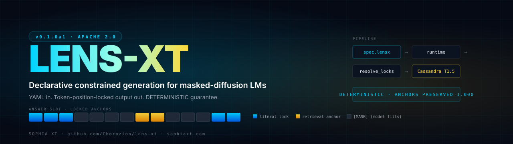

<div align="center">



&nbsp;

[](LICENSE)
[](https://creativecommons.org/licenses/by/4.0/)
[](https://www.python.org/)
[](#status)
[](https://github.com/Chorozion/Casandra-t1-diffusion-edge-model)

**Declarative spec language for token-level deterministic generation in masked-diffusion LMs**

[Spec](https://sophiaxt.com/lens-x-spec.pdf) · [Research](https://sophiaxt.com/research/anchor-token-masking) · [Cassandra T1](https://github.com/Chorozion/Casandra-t1-diffusion-edge-model) · [SOPHIA XT](https://sophiaxt.com)

</div>

---

A `.lensx` document specifies **position-locked content, retrieval sources, adapter selection, and validation rules**. The runtime resolves the spec into a forced-anchor-decoded generation against the chosen backend. Locked positions are excluded from the unmasking loop — they cannot be overwritten across denoising steps.

```yaml
# medical_basic.lensx
version: "0.1"
base:
  model: "cassandra-t1.5"
locks:
  - range: [0, auto]
    source: locus("medical:cardiology:nitroglycerin:standard_dose")
generation:
  total_length: 192
```

```bash
lensx run medical_basic.lensx
```

The locked content appears at the exact positions you specified — *guaranteed by construction* on masked-diffusion backends, best-effort with logit-bias on autoregressive APIs.

---

## Why this exists

Existing approaches to constrained generation are imperative or grammar-based:

| Approach | What it constrains | Guarantee level |
|---|---|---|
| Prompt engineering | natural-language hints | **none** |
| OpenAI structured outputs / JSON mode | schema fields | type-level |
| Outlines / LMQL / Guidance | regex/CFG over output | type-level |
| JSON Schema validation | post-hoc check | retry on failure |
| **LENS-XT** | **token positions in the answer slot** | **DETERMINISTIC on MDLM, best-effort on API** |

LENS-XT separates *what to constrain* (the spec, CC BY 4.0) from *how to enforce it* (the runtime, Apache 2.0).

## Status

> v0.1.0a1 — alpha. Runtime works end-to-end against the real Cassandra T1.5 model (`anchor_preservation_rate: 1.000`, DETERMINISTIC guarantee preserved). API surfaces may shift before v0.1.0.

| Component | Status |
|---|---|
| YAML parser + AST | ✅ shipped |
| Static validator | ✅ shipped |
| Lock resolver (literal / locus / retrieval / compose) | ✅ shipped |
| LTMi-XT keyword retrieval (v0.1) | ✅ shipped |
| LTMi-XT lattice-walk retrieval (v0.2 — BLAKE2b spec §2.4 compliant) | ✅ shipped |
| Reasoning scaffold runtime (multi-stage) | ✅ shipped |
| Local MDLM backend (Cassandra T1.5) | ✅ shipped |
| OpenAI API backend (logit-bias + retry, BEST_EFFORT guarantee) | ✅ shipped |
| Runtime orchestrator + CLI | ✅ shipped |
| Specification document | ✅ [Read the spec](https://sophiaxt.com/lens-x-spec.pdf) |
| Python SDK three-line drop-in | ✅ shipped |
| TypeScript SDK (`@sophiaxt/lens-xt`) | ✅ shipped |
| HTTP API server (FastAPI) | ✅ shipped |
| Anthropic API backend | 📋 planned |
| Mercury 2 native backend | 📋 pending Inception API support |

**Tests:** 168 unit + 8 backend tests passing, including a live integration against Cassandra T1.5 with `anchor_preservation_rate=1.0`.

## Install

```bash
pip install lens-xt          # core (parser, validator, runtime)
pip install lens-xt[local]   # adds torch + tokenizers for Cassandra backend
pip install lens-xt[all]     # everything
```

> Not on PyPI yet — install from source: `pip install -e .` from a clone of this repo.

## Quick start

```bash
# Validate a spec without running it
lensx validate examples/medical_basic.lensx

# Show a human-readable breakdown of the spec
lensx explain examples/medical_basic.lensx

# Run end-to-end against Cassandra T1.5
lensx run examples/medical_basic.lensx --var user_input="What's the dose?" --show-provenance
```

Programmatic:

```python
from lensx import run

result = run("examples/medical_basic.lensx", variables={"user_input": "..."})
print(result.text)                           # generated output
print(result.locked_positions_preserved)     # True
print(result.achieved_guarantee)             # GuaranteeLevel.DETERMINISTIC
print(result.metrics["anchor_preservation_rate"])  # 1.0
```

## Concepts

### Locks

A *lock* is a contiguous range of token positions whose values are deterministically set by the spec, not the model. Lock content can come from:

- `literal("...")` — explicit text
- `locus("topic:subtopic:concept:slot")` — looked up by breadcrumb in an LTMi-XT bundle
- `retrieval[N]` — references the Nth retrieved locus from the `retrieval:` block
- `lensx_compose(path)` — composes another spec's output

Range types: `[start, end]` explicit; `[start, auto]` left-aligned auto-sized; `head(N)` / `tail(N)` / `at(N)` aligned-and-sized; mix freely.

### Backends

The same `.lensx` file works across backends with different guarantee levels — the runtime picks the strongest available:

| Backend | Where it runs | Guarantee |
|---|---|---|
| Local MDLM | Cassandra T1.5, LLaDA, DiffuLLaMA (self-hosted) | **DETERMINISTIC** |
| API-compatible | OpenAI / Anthropic / Mercury 2 standard API | **BEST_EFFORT** (~99% via logit-bias + retry) |
| API-native | Future Mercury 2 with native lensx | **DETERMINISTIC** |
| Hybrid | API surround + local locked positions | **DETERMINISTIC** |

### Retrieval — LTMi-XT lattice walk

LENS-XT's retrieval scorer uses the LTMi-XT lattice topology: loci sharing a *k*-prefix in their breadcrumb hierarchy share *k* lattice coordinates (BLAKE2b-derived per [LTMi-XT spec §2.4](https://sophiaxt.com/ltmi-xt-spec.pdf)). The `lattice` mode walks outward from keyword seeds in lattice space, surfacing topical neighbors that don't share enough surface keywords with the query but are spatially adjacent.

```yaml
retrieval:
  bundles: ["corpora/cardiology.ltmi"]
  query: "${user_input}"
  top_k: 3
  scoring:
    mode: lattice  # or "keyword" for v0.1 behavior
```

### Adapters

LENS-XT works best with V/O-only anchor-token-masked LoRA adapters trained per domain. The methodology is empirically validated — **1.67× pooled OOD generalization advantage** over standard masking, with mechanism causally tested via V/O ablation.

→ Read the visualized research: **[sophiaxt.com/research/anchor-token-masking](https://sophiaxt.com/research/anchor-token-masking)** *(or download the [PDF · 14 pp](https://sophiaxt.com/anchor-token-masking-arxiv.pdf))*

## License

- **Reference runtime** (this repository): [Apache 2.0](LICENSE)
- **Specification document**: [CC BY 4.0](https://creativecommons.org/licenses/by/4.0/)
- **Adapters**: community adapters under Apache 2.0; premium domain-specific adapters under commercial license

## Citation

```bibtex
@techreport{garren2026lensx,
  author      = {Garren, Thomas},
  title       = {LENS-XT v0.1: A Declarative Specification Language for
                 Deterministically Constrained Generation in
                 Discrete-Sequence Diffusion Models},
  institution = {SOPHIA XT LLC},
  year        = {2026},
  month       = {May},
  url         = {https://sophiaxt.com/lens-x-spec}
}
```

## Related work

- [Cassandra T1](https://github.com/Chorozion/Casandra-t1-diffusion-edge-model) — reference 1.3B masked-diffusion language model · Apache 2.0
- [LTMi-XT](https://sophiaxt.com/research/ltmi-xt) — retrieval format with hash-derived topological indexing · Apache 2.0
- [Anchor-Token Masking](https://sophiaxt.com/research/anchor-token-masking) — training methodology for V/O-only anchor-token-masked LoRA adapters · Apache 2.0

## Maintainer

Thomas Garren · SOPHIA XT LLC · `thomas@sophiaxt.com` · [sophiaxt.com](https://sophiaxt.com)
